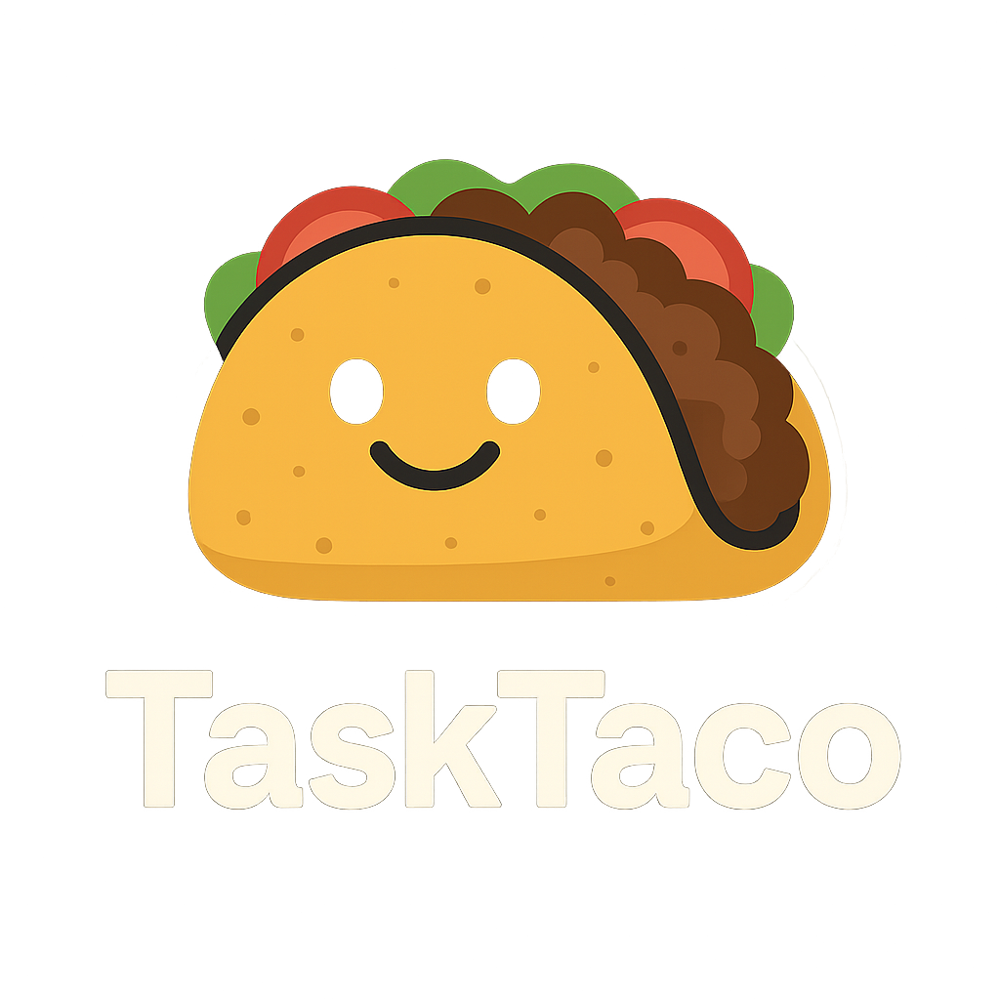

<p align="center">
  
  <br/>
  <em>Free, local-first Kanban. Privacy-first. No subscriptions.</em>
  </p>

TaskTaco is a local-first Kanban app that runs entirely on your device. It’s fast, friendly, and fun—complete with playful themes like Classic Taco, Guacamole, and Salsa. Your data stays local in SQLite.

## Why TaskTaco

- Local-first: your data lives with you (SQLite). No cloud, no telemetry.
- Lightweight and fast: React + Vite frontend, ASP.NET Core backend.
- Delightful UI with smooth drag-and-drop (powered by @dnd-kit/core).

## Features

- Kanban board with draggable tasks and smooth animations
- Themes: Classic Taco, Guacamole, Salsa, dark mode by default
- Emoji stickers, labels, checklists, priorities, and due dates
- Profile management: avatar upload/delete, change password, user settings
- Offline-friendly: everything stored locally

## Tech Stack

- Backend: ASP.NET Core 8 Web API, EF Core, SQLite, Identity, JWT
- Frontend: React 18, TypeScript, Vite, Tailwind CSS, shadcn/ui, @dnd-kit/core
- Tests: xUnit (server), Vitest (client)
- Packaging: Electron (planned)

Client dependencies in use:
- UI: shadcn/ui (Radix primitives), lucide-react icons
- DnD: @dnd-kit/core, @dnd-kit/sortable, @dnd-kit/utilities
- Styling: tailwindcss, @tailwindcss/postcss, tailwind-merge, class-variance-authority, clsx
- Theming: next-themes
- Dates: date-fns, react-day-picker

## Project Structure

```
TaskTaco/
├─ Kanban.Server/           # ASP.NET Core Web API
│  ├─ Controllers/          # API controllers only
│  └─ Models/               # Request/response DTOs used by controllers
├─ Kanban.Client/           # React + TypeScript frontend
├─ Kanban.Domain/           # Domain entities and value objects
├─ Kanban.Application/      # Application services
├─ Kanban.Infrastructure/   # EF Core, DbContext, migrations
└─ specs/                   # Feature specifications and plans
```

Note: Models were moved out of Controllers into `Kanban.Server/Models` to keep controllers lean and the structure clean.

## Run It (Windows)

Prerequisites:
- .NET SDK 8+
- Node.js 18+ and npm

```cmd
cd TaskTaco\Kanban.Server
dotnet run
```

```cmd
cd TaskTaco\Kanban.Client
npm install
npm run dev
```

Defaults:
- API: http://localhost:5090
- Web: Vite dev server on http://localhost:5173 (or next free port)
- DB file: `Kanban.Server/Kanban.db`

Build for production:

```cmd
cd Kanban.Client
npm run build

cd ..\Kanban.Server
dotnet publish -c Release
```

Electron packaging is planned; installers will be published in Releases when ready.

## Tests

```cmd
dotnet test

cd Kanban.Client
npm run test
```

E2E note: Cypress has been removed to keep dependencies lean. If E2E tests are needed later, consider Playwright or WebdriverIO.

## Optional: Git hooks

You can enable an optional pre-commit hook to keep builds and tests green:

```cmd
git config core.hooksPath .githooks
```

E2E note: Cypress is removed to keep dependencies lean. If E2E tests are needed later, consider Playwright or WebdriverIO.
On macOS/Linux you may need to make the hook executable:

```bash
chmod +x .githooks/pre-commit
```

The hook will build the solution and run server tests before allowing a commit.

## License

MIT License. See `LICENSE` for details.

---

Made with care for privacy and productivity. TaskTaco: where tasks meet taste 🌮
