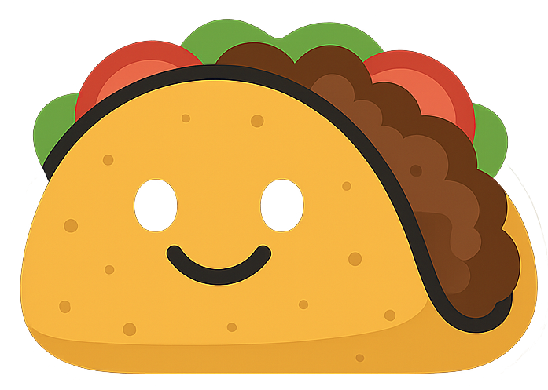

# 🌮 TaskTaco



**🌮 TaskTaco – A free, local-first Kanban board that turns your tasks into flavor.**

TaskTaco is a privacy-first, offline Kanban tool designed for individual users who want to own their data without recurring SaaS costs. Built with modern web technologies and packaged as a desktop app, it runs entirely on your device with local SQLite storage.

## 🌟 Features

- **🍅 Local-First & Offline**: No internet required, no data sharing – your tasks stay on your device
- **🎨 Customizable Themes**: Choose from Classic Taco 🌮, Guacamole 🥑, or Salsa 🌶️ themes
- **📋 Enhanced Task Management**:
  - Priority levels (Low, Medium, High)
  - Labels and tags
  - Interactive checklists
  - Sticker emojis
  - Due dates with overdue indicators
- **👤 Profile Management**: Upload profile pictures, change passwords, customize settings
- **🔄 Smooth Drag & Drop**: Seamless task movement between columns
- **💾 Data Persistence**: All settings, themes, and data survive app restarts
- **🖥️ Desktop App**: Electron-powered executable for Windows

## 🚀 Quick Start

### Prerequisites
- [.NET 8 SDK](https://dotnet.microsoft.com/download/dotnet/8.0)
- [Node.js 18+](https://nodejs.org/)
- [Git](https://git-scm.com/)

### Running Locally (Web Version)

1. **Clone the repository**
   ```bash
   git clone https://github.com/your-username/TaskTaco.git
   cd TaskTaco
   ```

2. **Start the backend**
   ```bash
   cd Kanban.Server
   dotnet run
   ```
   The API will be available at `http://localhost:5090`

3. **Start the frontend** (in a new terminal)
   ```bash
   cd Kanban.Client
   npm install
   npm run dev
   ```
   The app will be available at `http://localhost:5174`

4. **Open your browser** and navigate to `http://localhost:5174`

### Building the Desktop App

1. **Install Electron dependencies**
   ```bash
   cd Kanban.Client
   npm install
   ```

2. **Build the web app**
   ```bash
   npm run build
   ```

3. **Package as Electron app**
   ```bash
   npm run electron:build
   ```

The executable will be created in the `dist-electron` folder.

## 📥 Direct Downloads

Get the latest ready-to-use TaskTaco desktop app:

- **[Download TaskTaco for Windows (.exe)](https://github.com/your-username/TaskTaco/releases/latest)**

*More platforms coming soon: macOS (.dmg), Linux (.AppImage)*

## 🛠️ Development

### Project Structure
```
TaskTaco/
├── Kanban.Server/          # ASP.NET Core 8 Web API
├── Kanban.Client/          # React 18 + TypeScript frontend
├── Kanban.Domain/          # Domain entities and business logic
├── Kanban.Application/     # Application services
├── Kanban.Infrastructure/  # Data access and infrastructure
└── specs/                  # Feature specifications and plans
```

### Tech Stack
- **Backend**: ASP.NET Core 8, EF Core, SQLite, ASP.NET Identity, JWT, SignalR
- **Frontend**: React 18, TypeScript, Vite, Tailwind CSS, @dnd-kit/core, shadcn/ui
- **Testing**: xUnit, Vitest, Cypress
- **Packaging**: Electron

### Running Tests
```bash
# Backend tests
dotnet test

# Frontend tests
cd Kanban.Client
npm run test

# E2E tests
npm run cypress:run
```

## 🤝 Contributing

TaskTaco is open source and welcomes contributions! Please see our [Contributing Guide](CONTRIBUTING.md) for details.

## 📄 License

TaskTaco is released under the MIT License. See [LICENSE](LICENSE) for details.

## 🌮 About

TaskTaco was created to give users back control of their task management data. No subscriptions, no cloud storage, no tracking – just a delicious way to organize your work.

*Made with ❤️ and a sprinkle of taco seasoning*</content>
<parameter name="filePath">c:\Users\chabo\Documents\GitHub\TaskTaco\README.md